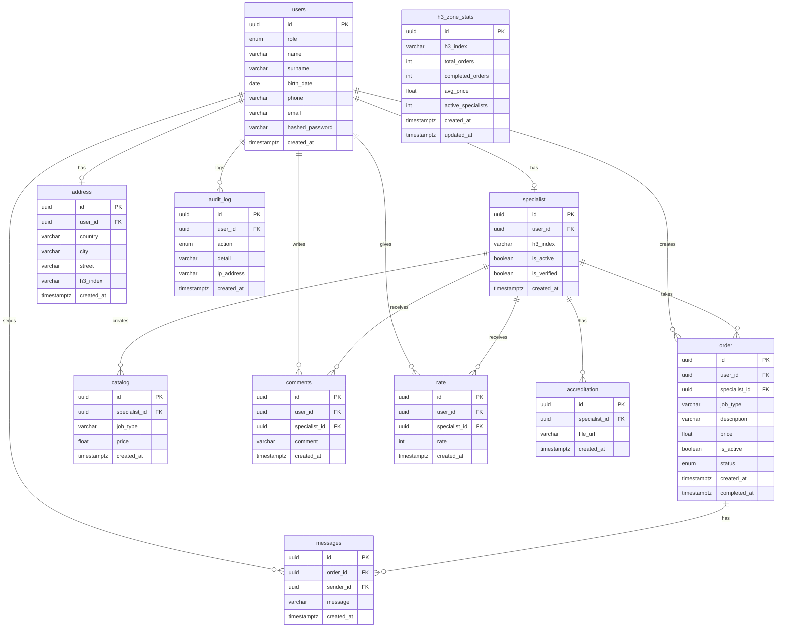

# Functional Requirements
---
## User

| # | As a... | I can...     | Object     |
| - | ------- | ------------ | ---------- |
| 1 | User    | **register** | Profile    |
| 2 | User    | **create**   | Order      |
| 3 | User    | **create**   | Specialist |
| 4 | User    | **complete** | Order      |

## Specialist

| # | As a...    | I can...   | Object  |
| - | ---------- | ---------- | ------- |
| 1 | Specialist | **create** | Catalog |
| 2 | Specialist | **take**   | Order   |

## Admin

| # | As a... | I can...   | Object     |
| - | ------- |------------| ---------- |
| 1 | Admin   | **verify** | Specialist |
| 1 | Admin   | **ban**    | Specialist |

## Any User

| # | As a... | I can... | Object             |
| - | ------- | -------- | ------------------ |
| 1 | Any     | **see**  | Active Orders      |
| 2 | Any     | **see**  | Specialist Catalog |
| 3 | Any     | **see**  | Active Specialists |

---

# ERD

